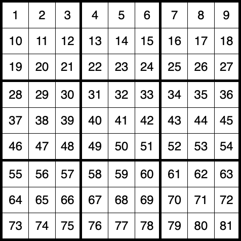

# SudokuGen

A fast sudoku puzzle generator.

## Installation

```bash
npm install sudoku-gen
```

## Usage

You can generate a sudoku using the `getSudoku` command, passing an optional difficulty level:

```javascript
import { getSudoku } from 'sudoku-gen';

// Get a sudoku of specific difficulty (easy, medium, hard, expert)
const sudoku = getSudoku('easy');

// Get a sudoku of random difficulty
const sudoku = getSudoku();
```

`getSudoku` returns an object:

```javascript
{
  puzzle: '41--75-----53--7--2-36-81--7-9--25-1-3--9-47--2-1-7---6587--9-----26-8--1925---47',
  solution: '416975238985321764273648159769432581531896472824157396658714923347269815192583647',
  difficulty: 'easy',
};
```

`puzzle` and `solution` are both 81 character strings representing the 81 cells in a sudoku grid:



`puzzle` contains placeholder dashes (`-`) for spaces which need to be filled in by the player. `solution` contains the entire grid so you can check the player's progress. The example code above would map to the following puzzle/solution:


## How it works

Most sudoku generators start with a completed sudoku grid and remove numbers one at a time, using a backtracking algorithm to stop once the puzzle becomes unsolvable. This process is too slow to be performed in real-time, so usually requires a background task and database for generating and storing puzzles as they're created.

SudokuGen works differently. It starts with a known, solvable "seed" puzzle and performs various transformations to turn it into a brand new puzzle. This makes it extremely fast, with no requirement for a back end, whilst maintaining quality.

Each seed gives over 2.4 trillion unique puzzles. To put that in context, if you played sudoku 24/7 and took 3 minutes to solve each puzzle, it would take until your 13,915,534th birthday to exhaust a single seed :birthday:

### Transformations

The following transformations are used ("!" = [factorial](https://en.wikipedia.org/wiki/Factorial)):

* **Rotate board** - 4 permutations (0&deg;, 90&deg;, 180&deg;, 270&deg;).
* **Shuffle column groups ("stacks")** - 6 permutations (3!).
* **Shuffle row groups ("bands")** - 6 permutations (3!).
* **Shuffle columns** - 216 permutations (3! x 3! x 3!).
* **Shuffle rows** - 216 permutations (3! x 3! x 3!).
* **Swap numbers** - 362,880 permutations (9!).

**Total permutations per seed** = 4 x 6 x 6 x 216 x 216 x 362,880 = 2,437,996,216,320.
